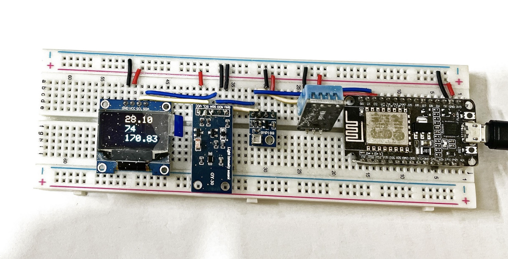
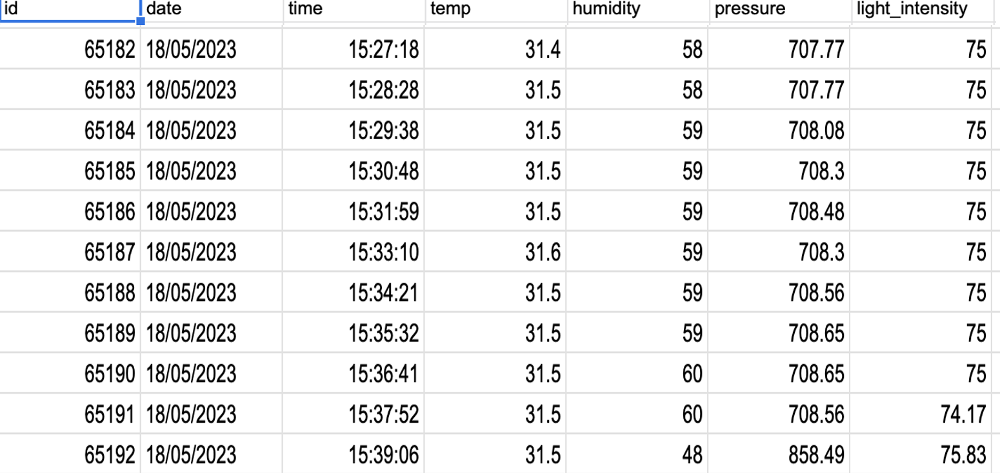

# ESP8266 Data Collection for Machine Learning

## Overview

This project showcases how to collect environmental data using an ESP8266 microcontroller and log it to Google Sheets via the Google Sheets API. The collected data, including temperature, humidity, pressure, and light intensity, is intended for use in machine learning applications.

## Data Logging

- The ESP8266 periodically collects environmental data from sensors.
- Data is transmitted and logged in real-time to a Google Sheets spreadsheet.
- The collected dataset is prepared for machine learning tasks, including data preprocessing and feature engineering.

## Machine Learning

- The logged data serves as valuable input for machine learning models and data analysis.
- Various machine learning algorithms can be applied for predictive analytics, anomaly detection, or trend analysis.

## Project Structure

- `code.ino` - Contains the ESP8266 firmware code.
- `img/` - Images and visual assets, including the circuit diagram.

